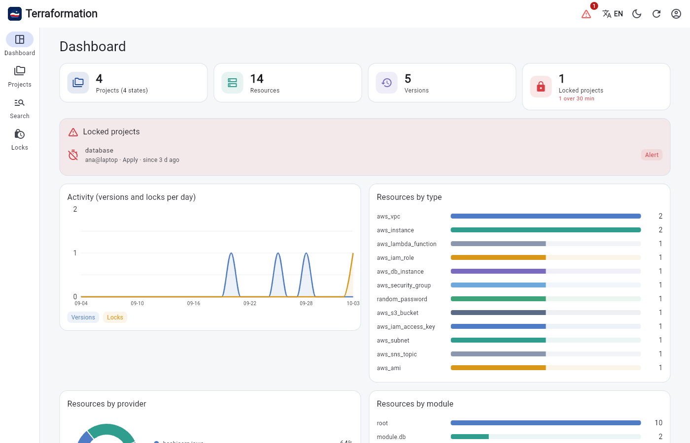
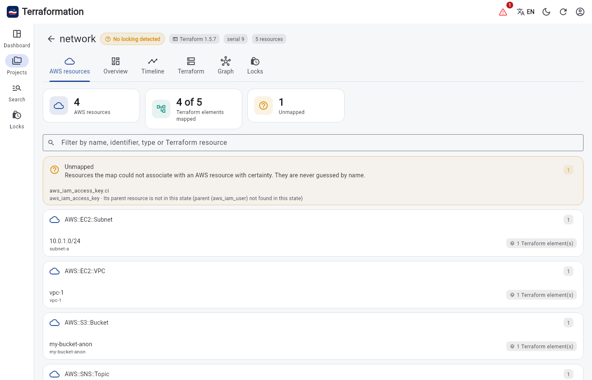
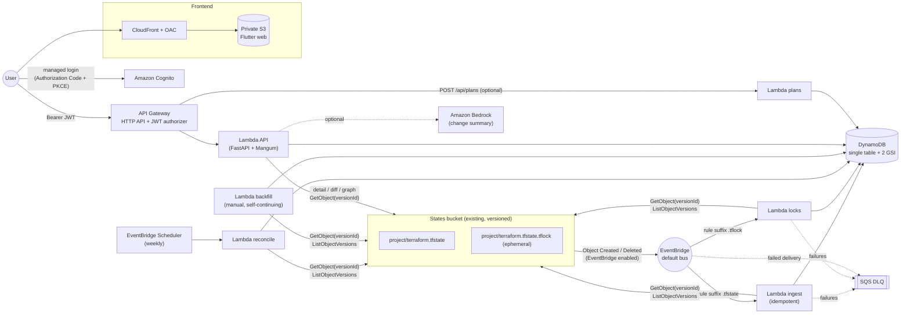

<p align="center">
  
</p>

<h1 align="center">Terraformation</h1>

<p align="center">
  <a href="docs-es/README.md">🇪🇸 Documentación en español</a>
</p>

**Serverless** viewer for Terraform states stored in a remote **AWS S3** backend. It is a modern successor,
focused on S3 only, of [terraboard](https://github.com/camptocamp/terraboard) (unmaintained for years). License
**Apache-2.0** — see [NOTICE](NOTICE).

* **Event-driven**: S3 → EventBridge → Lambda. No polling, no servers, no database to manage.
* **Full history** thanks to S3 versioning (`ListObjectVersions` + `GetObject` by `versionId`).
* **Native S3 locks** (`<project>/terraform.tfstate.tflock`): locked / released / no locking detected, with a duration alert.
* **Secure**: the raw state is never stored in DynamoDB; secrets masked at ingestion; least-privilege IAM; Cognito + JWT.
* **Cheap**: HTTP API, EventBridge, SQS and provisioned DynamoDB within the free tier. Typical cost of a small workload: cents per month.
* **Bilingual UI**: English by default, with a language button (EN / ES) in the app bar.

> **Scope**: S3 only. No support for GCS, Terraform Cloud, GitLab, MinIO or DynamoDB lock tables.

## Screenshots


*Dashboard: projects, resources, versions, activity, and breakdowns by type, provider and module.*


*AWS resources view: what a state deploys, grouped like a CloudFormation stack. Light and dark themes are supported.*

---

## Contents

0. [Screenshots](#screenshots)
1. [Architecture](#architecture)
2. [Bucket and lock conventions](#bucket-and-lock-conventions)
3. [Features (and terraboard equivalents)](#features-and-terraboard-equivalents)
4. [Estimated costs](#estimated-costs)
5. [Prerequisites](#prerequisites)
6. [Step-by-step deployment](#step-by-step-deployment)
7. [Initial backfill and reconciliation](#initial-backfill-and-reconciliation)
8. [Recommended lifecycle for `.tflock` files](#recommended-lifecycle-for-tflock-files)
9. [Stack parameters](#stack-parameters)
10. [Operations and troubleshooting](#operations-and-troubleshooting)
11. [Security](#security)
12. [Development](#development)
13. [Languages](#languages)
14. [Gitflow, CI/CD and environments](#gitflow-cicd-and-environments)
15. [Known limitations](#known-limitations)

---

## Architecture



### Components

| Piece | Technology | Responsibility |
|---|---|---|
| `infra/` | CloudFormation + SAM (root stack + 4 nested) | All the infrastructure (no Terraform) |
| `backend/src/terraformation` | Python 3.13, **Pydantic v2**, **FastAPI**, Powertools | Parser, diff, graph, ingestion, locks, API |
| `frontend/` | Flutter web, Riverpod, go_router, fl_chart | UI: dashboard, timeline, diff, graph, search, locks |
| `docs/openapi.yaml` | Generated by FastAPI | API contract (the Dart client is validated against it) |
| `docs/DECISIONS.md` | — | Design decisions and their rationale |
| `docs/DATA_MODEL.md` | — | Single DynamoDB table and access patterns |
| `docs/AWS_MAP.md` | — | Terraform → AWS resources map |

### Event flow

1. **Someone runs `terraform apply`** → S3 creates a new version of `project/terraform.tfstate` and emits `Object Created` to EventBridge with its `version-id`.
2. The rule filters by **suffix** `terraform.tfstate` and calls the **ingestion Lambda**:
   1. `HeadObject(versionId)` → `LastModified`; if the `VERSION#<LastModified>#<versionId>` item already exists → *duplicate*, ignored (idempotency by `bucket/key/versionId`).
   2. `GetObject(versionId)` → v4 parser → secret masking.
   3. Computes `+added / −removed / ~modified` against the previous version (and recalculates the successor if the event arrived **out of order**).
   4. If it is the newest version by `(LastModified, serial)`, it updates the project summary and the resource items (only the ones that changed).
   5. Writes the version item in a transaction (with activity counters).
3. Failures are retried (EventBridge policy + asynchronous Lambda invocation) and end up in the **SQS DLQ**.
4. **Locks**: a created/deleted `.tflock` triggers the locks Lambda. Events only *trigger*; the state is rebuilt with `ListObjectVersions(Prefix=<key>)` (newest version ⇒ locked, newest *delete marker* ⇒ released). It is idempotent and tolerates duplicates and out-of-order delivery.
5. The **backfill** (once) and the **weekly reconciliation** walk every version in case an event was missed.

Details and the reasons behind each decision: [`docs/DECISIONS.md`](docs/DECISIONS.md).

### Lock states in the UI

| State | Meaning |
|---|---|
| 🔒 **Locked** | A current `.tflock` exists. Shows who (`Who`), operation, Terraform version and since when (`Created`). If it exceeds the threshold (`LockAlertMinutes`, 30 by default) it is highlighted as an **alert**. |
| 🔓 **Released** | The last event was a *delete marker* of the `.tflock`. |
| ❔ **No locking detected** | A `.tflock` was never seen for that state → `use_lockfile = true` may be missing. |

---

## Bucket and lock conventions

* Every **key at the root** of the bucket is a **project**. Inside the project, **any `*.tfstate` file at any depth** is detected: `project/terraform.tfstate`, `project/network/prod.tfstate`, `project/apps/web/terraform.tfstate`…
* **Workspaces** (Terraform's default prefix): `env:/<workspace>/project/<path>.tfstate`. The `env:` prefix is never interpreted as a project.
* A *state* in the UI is **project + workspace + path** (the path relative to the project, file included). The dashboard groups states by project. A stray `.tfstate` at the bucket root (no project) is ignored.
* **Native S3 locking** (Terraform ≥ 1.10): `project/terraform.tfstate.tflock`, which exists only while a `plan`/`apply` runs. At rest the bucket contains only the `.tfstate` files.
* `.tflock` files are **never** treated as state: the EventBridge rules filter by the `.tfstate` and `.tfstate.tflock` suffixes and the key parser requires the key to end exactly in `.tfstate`.

Expected Terraform backend:

```hcl
terraform {
  backend "s3" {
    bucket       = "<your-bucket>"
    key          = "<project>/<optional-path>/terraform.tfstate"   # any name ending in .tfstate
    region       = "us-east-1"
    encrypt      = true
    use_lockfile = true   # native S3 locking (produces the .tflock)
  }
}
```

---

## Features (and terraboard equivalents)

| terraboard component | Serverless replacement in Terraformation |
|---|---|
| Go binary + HTTP server (`main.go`, `api/`) | **API Gateway HTTP API** + **FastAPI/Mangum** Lambda (`api/app.py`); generated OpenAPI contract |
| SQL database (GORM: PostgreSQL/SQLite, `db/`, `types/db.go`) | **DynamoDB** single table + 2 GSI (`store.py`, [model](docs/DATA_MODEL.md)); raw state is not stored |
| Periodic polling sync (`state/aws.go`) | S3 → EventBridge → `ingest` Lambda **events**; initial backfill + weekly reconciliation (Scheduler) |
| `state/` providers (S3, GCS, TFC, GitLab) | **S3** only (`s3io.py`); reads by `versionId` |
| State parser (`state/state.go`, `types/json.go`) | `parser.py` — **v4** state (TF 0.12 → 1.x and OpenTofu), with `dependencies`, `sensitive_attributes` and masking |
| Comparison (`compare/`) | `diff.py` — added/removed/modified with attribute detail, unified and side-by-side diff, `sensitive_changed` |
| Search by type/name/module/attribute (`db.go`) | `GET /api/search` over GSI1 (type), GSI2 (name) and project query |
| `/api/locks` (DynamoDB locks lookup) | **Native S3 locks** via `.tflock` events; `GET /api/locks`, per-project history |
| `POST /api/plans` | Same payload (`lineage`, `terraform_version`, `git_remote`, `git_commit`, `ci_url`, `source`, `plan_json`); separate, optional Lambda (`EnablePlansApi`) |
| `/api/lineages`, `/api/lineages/stats` | `GET /api/projects`, `GET /api/dashboard` |
| `/api/state/...` | `GET /api/projects/{p}/versions/{versionId}` |
| `/api/state/compare` | `GET /api/projects/{p}/diff` |
| Vue.js frontend | **Flutter web** (Riverpod): dashboard, timeline, graph, diff, search |
| Authentication (external proxy/OIDC) | **Amazon Cognito** (managed login) + native HTTP API **JWT** authorizer |
| Docker / docker-compose / Helm | **CloudFormation/SAM** + CloudFront + private S3 (OAC) |
| logrus logs | Structured **JSON** logs (Powertools) with configurable retention |
| Swagger (swag) | FastAPI OpenAPI in [`docs/openapi.yaml`](docs/openapi.yaml) |

### What is new compared to the original

* Dashboard with resources per project/type/provider/module, Terraform versions in use and activity over time.
* Locked-project indicator (who, since when, which operation) and duration alert.
* Per-project timeline with change counts and lock/unlock marks.
* **Interactive graph** of resource dependencies (and a module dependency view) built from `dependencies`.
* Colored diff, unified and side-by-side view; change detection on sensitive values without exposing them.
* Optional natural-language summary with **Amazon Bedrock** (`EnableBedrockSummary=false` by default), in the language selected in the UI.
* **AWS resources view**: the AWS resources a state deploys, grouped like CloudFormation does ([`docs/AWS_MAP.md`](docs/AWS_MAP.md)).
* **English / Spanish UI** with a language button.

---

## Estimated costs

Small reference workload: ~20 projects, ~300 `apply`/month (≈600 state and lock events), 5 users,
~2,000 API calls/month, us-east-1 region. **Indicative estimate** — check the
[AWS Pricing Calculator](https://calculator.aws/) because prices change.

| Service | Usage | Approx. monthly cost |
|---|---|---|
| Lambda (arm64) | < 5,000 invocations, seconds of compute | **$0** (free tier) |
| DynamoDB provisioned | 5/5 + 2/5 + 2/5 RCU/WCU (< 25/25 free tier), < 1 GB | **$0** |
| API Gateway HTTP API | ~2,000 requests | **< $0.01** |
| EventBridge (S3 events, Scheduler) | AWS service events on the default bus | **$0** |
| SQS (DLQ) | almost no traffic | **$0** |
| Cognito (Essentials) | 5 MAU (first 10,000 free) | **$0** |
| CloudFront + S3 (frontend) | < 1 GB transfer, < 20 MB stored | **$0 – $0.05** |
| S3 (requests on the states bucket) | ~3,000 GET/LIST | **< $0.02** |
| CloudWatch Logs (14-day retention) | ~50 MB | **~$0.03** |
| CloudWatch Alarm (DLQ) | 1 alarm (10 free) | **$0** |
| KMS | AWS-managed keys | **$0** |
| X-Ray / Bedrock | disabled by default | **$0** |
| **Total** | | **≈ $0.05 – $0.50 / month** |

If you run a large backfill, temporarily use `TableBillingMode=PAY_PER_REQUEST` (≈ $1.25 per million writes).

---

## Prerequisites

* An AWS account and permissions for CloudFormation/IAM/Lambda/DynamoDB/SQS/EventBridge/Cognito/CloudFront/S3.
* An **existing states bucket** with **versioning enabled** (this project does not manage it).
* Terraform ≥ 1.10 with `use_lockfile = true` (for the `.tflock` files).
* **An S3 bucket for `sam package` artifacts** (same region; created automatically if it does not exist).
* Local tools: AWS CLI v2, `make`, [`uv`](https://docs.astral.sh/uv/) (Python 3.13), Flutter (stable), `jq` (manual activation only).
* Deploy the stack **in the same region as the states bucket** (EventBridge delivers events in that region; a stack rule checks it).

---

## Step-by-step deployment

> None of this runs automatically: **you** run the commands. Review with `make changeset` before applying.

```bash
# 0) Local environment and checks (they do not touch AWS)
make install
make check

# 1) Variables (adjust to your case; use PROFILE=<profile> if you use AWS CLI profiles)
export STATE_BUCKET=<states-bucket>
# ARTIFACT_BUCKET is optional: if omitted it is derived from the naming standard
# (bckt-<region>-terraformation-artifacts-<account>-<env>) and `make deploy` creates it if missing.
export REGION=<states-bucket-region>
export ENV=dev

# 2) (Optional but recommended) Review the change set without applying it
make changeset ENV=$ENV REGION=$REGION STATE_BUCKET=$STATE_BUCKET

# 3) Deploy the infrastructure (packages the arm64 Lambda code and the nested templates)
make deploy ENV=$ENV REGION=$REGION STATE_BUCKET=$STATE_BUCKET
#   With extra parameters, for example:
#   make deploy ... EXTRA_PARAMS="LockAlertMinutes=45 EnablePlansApi=true EnableXRay=true"

# 4) Create your Cognito user (no self sign-up; you will receive a temporary password by email)
make create-user ENV=$ENV REGION=$REGION EMAIL=you@example.com

# 5) Publish the frontend (builds Flutter, generates config.json from the outputs, uploads to S3 and invalidates CloudFront)
make web-deploy ENV=$ENV REGION=$REGION

# 6) Load the existing history (see next section)
make backfill ENV=$ENV REGION=$REGION
```

The frontend URL appears in the stack's `WebUrl` output (`aws cloudformation describe-stacks --stack-name terraformation-$ENV`).

### Enabling EventBridge on the bucket

`PutBucketNotificationConfiguration` **replaces the whole** notification configuration of the bucket. Therefore:

* **Automatic (default, `ManageBucketNotifications=true`)**: a custom resource reads the current configuration
  (existing SNS/SQS/Lambda), sends it back **intact** and only adds `EventBridgeConfiguration`.
  Custom resource permissions: only `s3:GetBucketNotification` and `s3:PutBucketNotification`.
  Deleting the stack does **not** disable EventBridge (other consumers may depend on it) unless `DisableNotificationsOnDelete=true`.
* **Manual (`ManageBucketNotifications=false`)**: the stack does not touch the bucket. Enable EventBridge yourself:

  ```bash
  make enable-eventbridge-manual STATE_BUCKET=<bucket> REGION=<region>            # dry-run: shows what would be sent
  make enable-eventbridge-manual STATE_BUCKET=<bucket> REGION=<region> APPLY=1     # applies (keeps what exists)
  ```
  or from the console: *S3 → bucket → Properties → Amazon EventBridge → Edit → On*.

### Optional: Terraform plans (`POST /api/plans`)

With `EnablePlansApi=true` a *client-credentials* Cognito client with scope `terraformation/plans.write` is created:

```bash
# Get the CI client secret and a token
POOL=$(aws cloudformation describe-stacks --stack-name terraformation-$ENV --query "Stacks[0].Outputs[?OutputKey=='UserPoolId'].OutputValue" --output text)
aws cognito-idp list-user-pool-clients --user-pool-id $POOL      # look for the "...-plans-ci" client
aws cognito-idp describe-user-pool-client --user-pool-id $POOL --client-id <id> --query UserPoolClient.ClientSecret --output text
TOKEN=$(curl -s -u <client-id>:<secret> -d 'grant_type=client_credentials&scope=terraformation/plans.write' \
  https://<cognito-domain>/oauth2/token | jq -r .access_token)

terraform show -json tfplan > plan.json
jq -n --arg l "<lineage>" --slurpfile p plan.json \
  '{lineage:$l, terraform_version:"1.10.0", git_remote:"...", git_commit:"...", ci_url:"...", source:"ci", plan_json:$p[0]}' \
 | curl -s -H "Authorization: Bearer $TOKEN" -H 'Content-Type: application/json' -d @- https://<api>/api/plans
```

A plan **summary** is stored (actions per resource and outputs), never the raw JSON.

---

## Initial backfill and reconciliation

* **Backfill** (`make backfill`): the Lambda walks `ListObjectVersions` of the whole bucket. For each `.tfstate` it records *all* historical versions and *delete markers* in ascending order (with change counts between consecutive versions); for each `.tflock` it rebuilds the lock history. It is **idempotent** (you can repeat it), skips what already exists and **reinvokes itself** with a cursor before using up its 15 minutes, so it needs no Step Functions. `.tflock` files never enter the state history.
  * Follow progress: `aws logs tail /aws/lambda/terraformation-$ENV-backfill --follow`.
  * For large histories, temporarily switch to `TableBillingMode=PAY_PER_REQUEST`.
* **Reconciliation** (EventBridge Scheduler, `rate(7 days)` by default; parameters `ReconcileSchedule` and `ReconcileEnabled`): the same logic as a **safety net**; it also realigns the current state and the resources. Manual run: `make reconcile-now`.
* **Failed events**: `make dlq-peek` shows the DLQ messages; to reprocess, `make reconcile-now` is enough (it rebuilds from S3, the source of truth). A CloudWatch alarm fires when the DLQ is not empty (`AlarmTopicArn` to notify through SNS).

---

## Recommended lifecycle for `.tflock` files

`.tflock` files produce non-current versions (each `apply` creates a version and a *delete marker*). Although they weigh ~300 bytes, you can expire them.

> ⚠️ **S3 Lifecycle does not filter by suffix**, and a size filter could expire small `.tfstate`
> versions (an empty state weighs almost the same as a lock). The **safe** way is to use the lock's
> **exact key** (`<project>/terraform.tfstate.tflock`) as `Prefix`: it is not a prefix of any `.tfstate`.

Generate the rules from your states' keys (read-only on AWS):

```bash
make lifecycle-rules STATE_BUCKET=<bucket> REGION=<region> DAYS=30 > tflock-rules.json
```

Result (one rule per lock; example):

```json
{
  "Rules": [
    {
      "ID": "tflock-noncurrent-1a2b3c4d5e",
      "Status": "Enabled",
      "Filter": { "Prefix": "my-project/terraform.tfstate.tflock" },
      "NoncurrentVersionExpiration": { "NoncurrentDays": 30 }
    }
  ]
}
```

**Apply it yourself**, merging it with the existing rules (`put-bucket-lifecycle-configuration` replaces the whole configuration):

```bash
aws s3api get-bucket-lifecycle-configuration --bucket <bucket> > current.json   # if it exists
# ...merge "Rules" of current.json with tflock-rules.json...
aws s3api put-bucket-lifecycle-configuration --bucket <bucket> --lifecycle-configuration file://merged.json
```

* `.tfstate` versions are never touched.
* Run it again when you create new projects/workspaces (limit: 1,000 rules per bucket).
* Expiration emits `Object Deleted` events with `deletion-type = Permanently Deleted`; the locks Lambda does **not** interpret them as a release and the history already persisted in DynamoDB is kept.

---

## Stack parameters

The main ones (full list in [`infra/template.yaml`](infra/template.yaml)):

| Parameter | Default | Description |
|---|---|---|
| `AppName`, `Environment` | `terraformation`, `dev` | Resource prefix/environment |
| `StateBucketName` / `StateBucketRegion` | — | States bucket and its region (must match the stack's) |
| `ManageBucketNotifications` | `true` | `false` = enable EventBridge manually |
| `TableBillingMode` | `PROVISIONED` | `PAY_PER_REQUEST` for on-demand |
| `LockAlertMinutes` | `30` | Alert threshold for active locks |
| `ReconcileSchedule` | `rate(7 days)` | Reconciliation frequency |
| `LogRetentionDays` | `14` | Log retention |
| `EnableXRay` | `false` | X-Ray tracing |
| `ThrottlingRateLimit/BurstLimit` | `20/40` | API throttling |
| `ExtraWebOrigin` | empty | Extra origin (CORS/Cognito) for local development |
| `EnablePlansApi` | `false` | Enables `POST /api/plans` |
| `EnableBedrockSummary` / `BedrockModelId` | `false` / Claude Haiku | AI summary (requires model access in Bedrock) |

---

## Operations and troubleshooting

| Symptom | What to check |
|---|---|
| No events arrive | Is EventBridge *On* on the bucket? Stack in the same region? `…-tfstate` and `…-tflock` rules in the EventBridge console. |
| The project does not show up | Run `make backfill`; check the `…-ingest` logs and the DLQ (`make dlq-peek`). |
| "No locking detected" | The backend does not use `use_lockfile = true` or there has been no `plan`/`apply` since the deployment (the backfill only sees locks if versions exist). |
| A version appears with an error | Unsupported state format (v4 only) or size > `MaxStateBytes`: it is recorded in the history with `parse_error`. |
| 401/403 on the API | Expired token or signed-out user; the JWT must come from the stack's pool. |
| The UI shows stale data | Use *Refresh* in the top bar; the API has no data cache (only of parsed states per container). |

Structured (JSON) logs in CloudWatch: `/aws/lambda/<app>-<env>-{ingest,locks,backfill,reconcile,api,plans}`.

---

## Security

* **Least-privilege IAM**, one role per function: the ingestion Lambdas only have `s3:GetObject`, `s3:GetObjectVersion`, `s3:ListBucket`, `s3:ListBucketVersions` on the states bucket and only the DynamoDB/SQS actions they use; the custom resource only `s3:GetBucketNotification` and `s3:PutBucketNotification`; the API is **read-only** on DynamoDB and plan writing lives in another function with only `dynamodb:PutItem`.
* **Secrets**: the raw state is not persisted; `sensitive_attributes`, values with typical patterns (AWS keys, PEM, JWT, GitHub/Slack tokens…) and attributes by name (`password`, `secret`, `token`…) are masked. Sensitive outputs are shown as `(sensitive)`. Changes in sensitive values are detected with a digest kept **in memory only**.
* **Encryption**: AWS-managed keys (DynamoDB, SQS-SSE, S3 SSE-S3) — no KMS cost.
* **API**: Cognito + native JWT authorizer, CORS restricted to the CloudFront domain, throttling, no public docs.
* **Frontend**: private S3 bucket + CloudFront with OAC, mandatory HTTPS and security headers (CSP, HSTS, `frame-ancestors 'none'`).
* **Validated templates** with `cfn-lint`, `checkov` (0 findings; justified skips in `Metadata`) and custom `cfn-guard` rules (`infra/guard`).
* No credentials, account IDs or real bucket names in the repo (anonymized fixtures).

---

## Development

```bash
make install        # Python 3.13 venv + dependencies
make check          # ruff, mypy, pytest (moto), OpenAPI in sync, cfn-lint, checkov
make openapi        # regenerate docs/openapi.yaml after changing the API
make guard          # cfn-guard (requires the binary)
make web-analyze web-test web-build
python scripts/e2e_smoke.py --shots /tmp/shots   # FastAPI + moto + Flutter build in Chromium
```

Layout:

```
backend/src/terraformation/   parser · masking · diff · graph · keys · store · ingest · locks · sync · api/ · handlers/
backend/tests/                pytest + moto + anonymized fixtures (tfstate 0.12 → 1.9 / OpenTofu, tflock)
infra/                        template.yaml + nested/{storage,web,ingestion,api}.yaml + guard/
frontend/                     Flutter web (features/{dashboard,projects,state,diff,graph,search,locks,shell}, l10n)
docs/                         DECISIONS · DATA_MODEL · GITFLOW · AWS_MAP · openapi.yaml
docs-es/                      Spanish version of the documentation
scripts/                      build_lambda · enable-eventbridge · lifecycle_tflock · export_openapi · e2e_smoke
```

---

## Languages

The code, API messages and documentation are in **English**. The web UI is **English by default** and can be
switched to **Spanish** with the language button (EN / ES) in the app bar, on the sign-in page and after
signing in. The choice is stored in the browser (`localStorage`, key `tf.lang`) and also drives the language of the
optional Bedrock summary. The Spanish documentation lives in [`docs-es/`](docs-es/README.md).

Strings are in `frontend/lib/l10n/app_strings.dart`; every string is declared with its English and Spanish text
side by side, so a missing translation fails at compile time.

---

## Gitflow, CI/CD and environments

The branch flow (`main` = prod, `develop` = dev, `feature/*`), the GitHub *environments*
(`dev`, `prod`) with their variables and secrets, and the `gh` commands to create them are in
[`docs/GITFLOW.md`](docs/GITFLOW.md). Workflows: `.github/workflows/ci.yml` (backend, templates, frontend)
and `deploy.yml` (OIDC → AWS; `develop` → `dev`, `main` → `prod`).

> **Note**: GitHub *environments*, variables/secrets and branch protection rules are repository settings
> that must be created by a repository admin. Everything is documented with the exact commands.

---

## Known limitations

* **v4 state only** (Terraform 0.12 → 1.x and OpenTofu). Earlier formats are recorded with `parse_error`.
* **Search covers the current version** of each state (not the full history): storing resources for every version would multiply the write cost. The detail, diff and graph of **any version** are computed on demand from S3. Type and name are exact matches; searching by attribute alone uses a filtered, bounded `Scan`.
* **Provider versions**: the v4 state does not include them; the providers in use are shown. (`version_constraint` arrives only with submitted plans.)
* **A single states bucket** per deployment (deploy another stack for another bucket).
* Very large states (> `MaxStateBytes`, 40 MB by default) are not parsed.
* Ingestion is not serialized per project unless you set `IngestReservedConcurrency=1`; in an unlikely race between two simultaneous versions, the weekly reconciliation fixes the resource items.
* `S3 → EventBridge` delivers *at-least-once* with no ordering guarantee; the design tolerates it (idempotency + ordering by `LastModified`/serial), but versions within the same second are ordered by serial.
* Cognito is not integrated with an external IdP (they can be added manually) and there is no custom domain for CloudFront (it uses `*.cloudfront.net`).

---

License: [Apache-2.0](LICENSE). Acknowledgements: [NOTICE](NOTICE).
