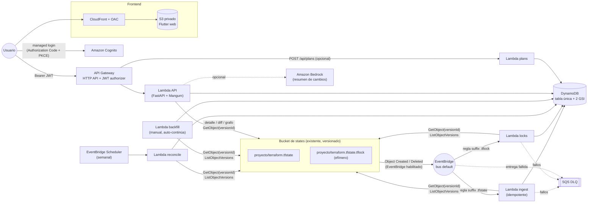

# Terraformation

Visor **serverless** de Terraform states almacenados en un backend remoto **AWS S3**. Es un sucesor
moderno, enfocado solo en S3, de [terraboard](https://github.com/camptocamp/terraboard) (sin
mantenimiento desde hace años). Licencia **Apache-2.0** — ver [NOTICE](NOTICE).

* **Dirigido por eventos**: S3 → EventBridge → Lambda. Sin polling, sin servidores, sin base de datos que administrar.
* **Historial completo** gracias al versionado de S3 (`ListObjectVersions` + `GetObject` por `versionId`).
* **Locks nativos de S3** (`<proyecto>/terraform.tfstate.tflock`): bloqueado / liberado / sin locking detectado, con alerta por duración.
* **Seguro**: el state crudo nunca se guarda en DynamoDB; secretos enmascarados en la ingesta; IAM de mínimo privilegio; Cognito + JWT.
* **Barato**: HTTP API, EventBridge, SQS y DynamoDB provisionada dentro del free tier. Costo típico de una carga pequeña: centavos al mes.

> **Alcance**: solo S3. No hay soporte para GCS, Terraform Cloud, GitLab, MinIO ni tablas de locks de DynamoDB.

---

## Contenido

1. [Arquitectura](#arquitectura)
2. [Convenciones del bucket y de los locks](#convenciones-del-bucket-y-de-los-locks)
3. [Funcionalidades (y equivalencias con terraboard)](#funcionalidades-y-equivalencias-con-terraboard)
4. [Costos estimados](#costos-estimados)
5. [Prerrequisitos](#prerrequisitos)
6. [Despliegue paso a paso](#despliegue-paso-a-paso)
7. [Backfill inicial y reconciliación](#backfill-inicial-y-reconciliación)
8. [Lifecycle recomendado para los `.tflock`](#lifecycle-recomendado-para-los-tflock)
9. [Parámetros del stack](#parámetros-del-stack)
10. [Operación y diagnóstico](#operación-y-diagnóstico)
11. [Seguridad](#seguridad)
12. [Desarrollo](#desarrollo)
13. [Gitflow, CI/CD y environments](#gitflow-cicd-y-environments)
14. [Limitaciones conocidas](#limitaciones-conocidas)

---

## Arquitectura



### Componentes

| Pieza | Tecnología | Responsabilidad |
|---|---|---|
| `infra/` | CloudFormation + SAM (stack raíz + 4 anidados) | Toda la infraestructura (sin Terraform) |
| `backend/src/terraformation` | Python 3.13, **Pydantic v2**, **FastAPI**, Powertools | Parser, diff, grafo, ingesta, locks, API |
| `frontend/` | Flutter web, Riverpod, go_router, fl_chart | UI: dashboard, timeline, diff, grafo, búsqueda, locks |
| `docs/openapi.yaml` | Generado por FastAPI | Contrato de la API (el cliente Dart se valida contra él) |
| `docs/DECISIONS.md` | — | Decisiones de diseño y su justificación |
| `docs/DATA_MODEL.md` | — | Tabla única de DynamoDB y patrones de acceso |

### Flujo de eventos

1. **Alguien ejecuta `terraform apply`** → S3 crea una nueva versión de `proyecto/terraform.tfstate` y emite `Object Created` a EventBridge con su `version-id`.
2. La regla filtra por **sufijo** `terraform.tfstate` y llama a la **Lambda de ingesta**:
   1. `HeadObject(versionId)` → `LastModified`; si el ítem `VERSION#<LastModified>#<versionId>` ya existe → *duplicado*, se ignora (idempotencia por `bucket/key/versionId`).
   2. `GetObject(versionId)` → parser v4 → enmascarado de secretos.
   3. Calcula `+agregados / −eliminados / ~modificados` contra la versión anterior (y recalcula el sucesor si el evento llegó **fuera de orden**).
   4. Si es la versión más reciente por `(LastModified, serial)` actualiza el resumen del proyecto y los ítems de recursos (solo los que cambiaron).
   5. Escribe el ítem de versión en una transacción (con contadores de actividad).
3. Los fallos se reintentan (política de EventBridge + invocación asíncrona de Lambda) y terminan en la **DLQ de SQS**.
4. **Locks**: un `.tflock` creado/borrado dispara la Lambda de locks. Los eventos solo *disparan*; el estado se reconstruye con `ListObjectVersions(Prefix=<key>)` (versión más reciente ⇒ bloqueado, *delete marker* más reciente ⇒ liberado). Es idempotente y tolera duplicados y desorden.
5. El **backfill** (una vez) y la **reconciliación semanal** recorren todas las versiones por si faltó algún evento.

Detalles y razones de cada decisión: [`docs/DECISIONS.md`](docs/DECISIONS.md).

### Estados de lock en la UI

| Estado | Significado |
|---|---|
| 🔒 **Bloqueado** | Existe un `.tflock` vigente. Se muestra quién (`Who`), operación, versión de Terraform y desde cuándo (`Created`). Si supera el umbral (`LockAlertMinutes`, 30 por defecto) se resalta como **alerta**. |
| 🔓 **Liberado** | El último evento fue un *delete marker* del `.tflock`. |
| ❔ **Sin locking detectado** | Nunca se vio un `.tflock` para ese state → posible falta de `use_lockfile = true`. |

---

## Convenciones del bucket y de los locks

* Cada **key de la raíz** del bucket es un **proyecto**. Dentro del proyecto se detecta **cualquier archivo `*.tfstate` a cualquier profundidad**: `proyecto/terraform.tfstate`, `proyecto/network/prod.tfstate`, `proyecto/apps/web/terraform.tfstate`…
* **Workspaces** (prefijo por defecto de Terraform): `env:/<workspace>/proyecto/<ruta>.tfstate`. El prefijo `env:` nunca se interpreta como proyecto.
* Un *state* en la UI es **proyecto + workspace + ruta** (la ruta relativa al proyecto, incluido el archivo). El dashboard agrupa los states por proyecto. Un `.tfstate` suelto en la raíz del bucket (sin proyecto) se ignora.
* **Locking nativo de S3** (Terraform ≥ 1.10): `proyecto/terraform.tfstate.tflock`, existe solo mientras corre un `plan`/`apply`. En reposo el bucket contiene solo los `.tfstate`.
* Los `.tflock` **jamás** se tratan como state: las reglas de EventBridge filtran por los sufijos `.tfstate` y `.tfstate.tflock` y el parser de keys exige que el key termine exactamente en `.tfstate`.

Backend de Terraform esperado:

```hcl
terraform {
  backend "s3" {
    bucket       = "<tu-bucket>"
    key          = "<proyecto>/<ruta-opcional>/terraform.tfstate"   # cualquier nombre terminado en .tfstate
    region       = "us-east-1"
    encrypt      = true
    use_lockfile = true   # locking nativo de S3 (genera el .tflock)
  }
}
```

---

## Funcionalidades (y equivalencias con terraboard)

| Componente de terraboard | Reemplazo serverless en Terraformation |
|---|---|
| Binario Go + servidor HTTP (`main.go`, `api/`) | **API Gateway HTTP API** + Lambda **FastAPI/Mangum** (`api/app.py`); contrato OpenAPI generado |
| Base de datos SQL (GORM: PostgreSQL/SQLite, `db/`, `types/db.go`) | **DynamoDB** tabla única + 2 GSI (`store.py`, [modelo](docs/DATA_MODEL.md)); sin guardar el state crudo |
| Sincronización periódica por polling (`state/aws.go`) | **Eventos** S3 → EventBridge → Lambda `ingest`; backfill inicial + reconciliación semanal (Scheduler) |
| Proveedores `state/` (S3, GCS, TFC, GitLab) | Solo **S3** (`s3io.py`); lectura por `versionId` |
| Parser del state (`state/state.go`, `types/json.go`) | `parser.py` — state **v4** (TF 0.12 → 1.x y OpenTofu), con `dependencies`, `sensitive_attributes` y enmascarado |
| Comparación (`compare/`) | `diff.py` — agregados/eliminados/modificados con detalle de atributos, diff unificado y lado a lado, `sensitive_changed` |
| Búsqueda por tipo/nombre/módulo/atributo (`db.go`) | `GET /api/search` sobre GSI1 (tipo), GSI2 (nombre) y consulta por proyecto |
| `/api/locks` (consulta a DynamoDB de locks) | **Locks nativos de S3** vía eventos `.tflock`; `GET /api/locks`, historial por proyecto |
| `POST /api/plans` | Igual payload (`lineage`, `terraform_version`, `git_remote`, `git_commit`, `ci_url`, `source`, `plan_json`); Lambda separada, opcional (`EnablePlansApi`) |
| `/api/lineages`, `/api/lineages/stats` | `GET /api/projects`, `GET /api/dashboard` |
| `/api/state/...` | `GET /api/projects/{p}/versions/{versionId}` |
| `/api/state/compare` | `GET /api/projects/{p}/diff` |
| Frontend Vue.js | **Flutter web** (Riverpod): dashboard, timeline, grafo, diff, búsqueda |
| Autenticación (proxy/OIDC externo) | **Amazon Cognito** (managed login) + authorizer **JWT** nativo de HTTP API |
| Docker / docker-compose / Helm | **CloudFormation/SAM** + CloudFront + S3 privado (OAC) |
| Logs logrus | Logs **JSON estructurados** (Powertools) con retención configurable |
| Swagger (swag) | OpenAPI de FastAPI en [`docs/openapi.yaml`](docs/openapi.yaml) |

### Novedades respecto al original

* Dashboard con recursos por proyecto/tipo/provider/módulo, versiones de Terraform en uso y actividad en el tiempo.
* Indicador de proyectos bloqueados (quién, desde cuándo, qué operación) y alerta por duración.
* Línea de tiempo por proyecto con conteo de cambios y marcas de lock/unlock.
* **Grafo interactivo** de dependencias entre recursos (y vista de dependencias entre módulos) a partir de `dependencies`.
* Diff con colores, vista unificada y lado a lado; detección de cambios en valores sensibles sin exponerlos.
* Resumen opcional en lenguaje natural con **Amazon Bedrock** (`EnableBedrockSummary=false` por defecto).

---

## Costos estimados

Carga pequeña de referencia: ~20 proyectos, ~300 `apply`/mes (≈600 eventos de state y lock), 5 usuarios,
~2.000 llamadas a la API/mes, región us-east-1. **Estimación orientativa** — verifica con la
[AWS Pricing Calculator](https://calculator.aws/) porque los precios cambian.

| Servicio | Uso | Costo mensual aprox. |
|---|---|---|
| Lambda (arm64) | < 5.000 invocaciones, segundos de cómputo | **$0** (free tier) |
| DynamoDB provisionada | 5/5 + 2/5 + 2/5 RCU/WCU (< 25/25 del free tier), < 1 GB | **$0** |
| API Gateway HTTP API | ~2.000 solicitudes | **< $0,01** |
| EventBridge (eventos de S3, Scheduler) | eventos de servicios AWS sobre el bus default | **$0** |
| SQS (DLQ) | casi sin tráfico | **$0** |
| Cognito (Essentials) | 5 MAU (primeros 10.000 gratis) | **$0** |
| CloudFront + S3 (frontend) | < 1 GB de transferencia, < 20 MB almacenados | **$0 – $0,05** |
| S3 (solicitudes sobre el bucket de states) | ~3.000 GET/LIST | **< $0,02** |
| CloudWatch Logs (retención 14 días) | ~50 MB | **~$0,03** |
| CloudWatch Alarm (DLQ) | 1 alarma (10 gratis) | **$0** |
| KMS | claves administradas por AWS | **$0** |
| X-Ray / Bedrock | desactivados por defecto | **$0** |
| **Total** | | **≈ $0,05 – $0,50 / mes** |

Si haces un backfill grande, usa temporalmente `TableBillingMode=PAY_PER_REQUEST` (≈ $1,25 por millón de escrituras).

---

## Prerrequisitos

* Cuenta de AWS y permisos para CloudFormation/IAM/Lambda/DynamoDB/SQS/EventBridge/Cognito/CloudFront/S3.
* **Bucket de states existente** con **versionado habilitado** (no lo administra este proyecto).
* Terraform ≥ 1.10 con `use_lockfile = true` (para los `.tflock`).
* **Un bucket S3 para artefactos** de `sam package` (en la misma región; se crea solo si no existe).
* Herramientas locales: AWS CLI v2, `make`, [`uv`](https://docs.astral.sh/uv/) (Python 3.13), Flutter (stable), `jq` (solo activación manual).
* Desplegar el stack **en la misma región del bucket de states** (EventBridge entrega los eventos en esa región; una regla del stack lo verifica).

---

## Despliegue paso a paso

> Nada de esto se ejecuta automáticamente: **tú** corres los comandos. Revisa con `make changeset` antes de aplicar.

```bash
# 0) Entorno local y verificaciones (no tocan AWS)
make install
make check

# 1) Variables (ajusta a tu caso; usa PROFILE=<perfil> si usas perfiles de AWS CLI)
export STATE_BUCKET=<bucket-de-states>
# ARTIFACT_BUCKET es opcional: si se omite, se deriva del estándar de nombres
# (bckt-<region>-terraformation-artifacts-<cuenta>-<env>) y `make deploy` lo crea si no existe.
export REGION=<region-del-bucket>
export ENV=dev

# 2) (Opcional pero recomendado) Revisar el change set sin aplicarlo
make changeset ENV=$ENV REGION=$REGION STATE_BUCKET=$STATE_BUCKET

# 3) Desplegar la infraestructura (empaqueta el código Lambda arm64 y las plantillas anidadas)
make deploy ENV=$ENV REGION=$REGION STATE_BUCKET=$STATE_BUCKET
#   Con parámetros extra, por ejemplo:
#   make deploy ... EXTRA_PARAMS="LockAlertMinutes=45 EnablePlansApi=true EnableXRay=true"

# 4) Crear tu usuario de Cognito (no hay auto-registro; recibirás una contraseña temporal por email)
make create-user ENV=$ENV REGION=$REGION EMAIL=tu@correo.com

# 5) Publicar el frontend (compila Flutter, genera config.json desde los outputs, sube a S3 e invalida CloudFront)
make web-deploy ENV=$ENV REGION=$REGION

# 6) Cargar el historial existente (ver siguiente sección)
make backfill ENV=$ENV REGION=$REGION
```

La URL del frontend aparece en el output `WebUrl` del stack (`aws cloudformation describe-stacks --stack-name terraformation-$ENV`).

### Activación de EventBridge en el bucket

`PutBucketNotificationConfiguration` **reemplaza toda** la configuración de notificaciones del bucket. Por eso:

* **Automático (por defecto, `ManageBucketNotifications=true`)**: un custom resource lee la configuración actual
  (SNS/SQS/Lambda existentes), la reenvía **íntegra** y agrega únicamente `EventBridgeConfiguration`.
  Permisos del custom resource: solo `s3:GetBucketNotification` y `s3:PutBucketNotification`.
  Al borrar el stack **no** desactiva EventBridge (otros consumidores podrían depender de él) salvo `DisableNotificationsOnDelete=true`.
* **Manual (`ManageBucketNotifications=false`)**: el stack no toca el bucket. Activa EventBridge tú mismo:

  ```bash
  make enable-eventbridge-manual STATE_BUCKET=<bucket> REGION=<region>            # dry-run: muestra qué se enviaría
  make enable-eventbridge-manual STATE_BUCKET=<bucket> REGION=<region> APPLY=1     # aplica (conserva lo existente)
  ```
  o desde la consola: *S3 → bucket → Properties → Amazon EventBridge → Edit → On*.

### Opcional: planes de Terraform (`POST /api/plans`)

Con `EnablePlansApi=true` se crea un cliente Cognito *client-credentials* con scope `terraformation/plans.write`:

```bash
# Obtener el secreto del cliente de CI y un token
POOL=$(aws cloudformation describe-stacks --stack-name terraformation-$ENV --query "Stacks[0].Outputs[?OutputKey=='UserPoolId'].OutputValue" --output text)
aws cognito-idp list-user-pool-clients --user-pool-id $POOL      # busca el cliente "...-plans-ci"
aws cognito-idp describe-user-pool-client --user-pool-id $POOL --client-id <id> --query UserPoolClient.ClientSecret --output text
TOKEN=$(curl -s -u <client-id>:<secret> -d 'grant_type=client_credentials&scope=terraformation/plans.write' \
  https://<dominio-cognito>/oauth2/token | jq -r .access_token)

terraform show -json tfplan > plan.json
jq -n --arg l "<lineage>" --slurpfile p plan.json \
  '{lineage:$l, terraform_version:"1.10.0", git_remote:"...", git_commit:"...", ci_url:"...", source:"ci", plan_json:$p[0]}' \
 | curl -s -H "Authorization: Bearer $TOKEN" -H 'Content-Type: application/json' -d @- https://<api>/api/plans
```

Se guarda un **resumen** del plan (acciones por recurso y outputs), nunca el JSON crudo.

---

## Backfill inicial y reconciliación

* **Backfill** (`make backfill`): la Lambda recorre `ListObjectVersions` de todo el bucket. Por cada `.tfstate` registra *todas* las versiones y *delete markers* históricos en orden ascendente (con conteo de cambios entre versiones consecutivas); por cada `.tflock` reconstruye el historial de locks. Es **idempotente** (puedes repetirlo), omite lo que ya existe y **se auto-reinvoca** con un cursor antes de agotar sus 15 minutos, así que no necesita Step Functions. Los `.tflock` nunca entran al historial de states.
  * Seguimiento: `aws logs tail /aws/lambda/terraformation-$ENV-backfill --follow`.
  * Para historiales grandes, cambia temporalmente a `TableBillingMode=PAY_PER_REQUEST`.
* **Reconciliación** (EventBridge Scheduler, `rate(7 days)` por defecto; parámetros `ReconcileSchedule` y `ReconcileEnabled`): misma lógica como **red de seguridad**; además realinea el estado vigente y los recursos. Ejecución manual: `make reconcile-now`.
* **Eventos fallidos**: `make dlq-peek` muestra los mensajes de la DLQ; para reprocesar basta `make reconcile-now` (reconstruye desde S3, que es la fuente de verdad). Hay una alarma de CloudWatch cuando la DLQ no está vacía (`AlarmTopicArn` para notificar por SNS).

---

## Lifecycle recomendado para los `.tflock`

Los `.tflock` generan versiones no actuales (cada `apply` crea una versión y un *delete marker*). Aunque pesan ~300 bytes, puedes expirarlas.

> ⚠️ **S3 Lifecycle no filtra por sufijo**, y un filtro por tamaño podría expirar versiones pequeñas de
> `.tfstate` (un state vacío pesa casi lo mismo que un lock). La forma **segura** es usar como `Prefix` la
> **key exacta** del lock (`<proyecto>/terraform.tfstate.tflock`): no es prefijo de ningún `.tfstate`.

Genera las reglas a partir de las keys de tus states (solo lectura en AWS):

```bash
make lifecycle-rules STATE_BUCKET=<bucket> REGION=<region> DAYS=30 > tflock-rules.json
```

Resultado (una regla por lock; ejemplo):

```json
{
  "Rules": [
    {
      "ID": "tflock-noncurrent-1a2b3c4d5e",
      "Status": "Enabled",
      "Filter": { "Prefix": "mi-proyecto/terraform.tfstate.tflock" },
      "NoncurrentVersionExpiration": { "NoncurrentDays": 30 }
    }
  ]
}
```

**Aplícalo tú**, combinándolo con las reglas existentes (`put-bucket-lifecycle-configuration` reemplaza toda la configuración):

```bash
aws s3api get-bucket-lifecycle-configuration --bucket <bucket> > actual.json   # si existe
# ...fusiona "Rules" de actual.json con tflock-rules.json...
aws s3api put-bucket-lifecycle-configuration --bucket <bucket> --lifecycle-configuration file://merged.json
```

* Nunca se tocan las versiones de los `.tfstate`.
* Ejecútalo de nuevo al crear proyectos/workspaces nuevos (límite: 1.000 reglas por bucket).
* La expiración emite eventos `Object Deleted` con `deletion-type = Permanently Deleted`; la Lambda de locks **no** los interpreta como liberación y el historial ya persistido en DynamoDB se conserva.

---

## Parámetros del stack

Los principales (lista completa en [`infra/template.yaml`](infra/template.yaml)):

| Parámetro | Por defecto | Descripción |
|---|---|---|
| `AppName`, `Environment` | `terraformation`, `dev` | Prefijo/entorno de los recursos |
| `StateBucketName` / `StateBucketRegion` | — | Bucket de states y su región (debe coincidir con la del stack) |
| `ManageBucketNotifications` | `true` | `false` = activar EventBridge manualmente |
| `TableBillingMode` | `PROVISIONED` | `PAY_PER_REQUEST` para on-demand |
| `LockAlertMinutes` | `30` | Umbral de alerta de locks activos |
| `ReconcileSchedule` | `rate(7 days)` | Frecuencia de la reconciliación |
| `LogRetentionDays` | `14` | Retención de logs |
| `EnableXRay` | `false` | Trazado X-Ray |
| `ThrottlingRateLimit/BurstLimit` | `20/40` | Throttling del API |
| `ExtraWebOrigin` | vacío | Origen extra (CORS/Cognito) para desarrollo local |
| `EnablePlansApi` | `false` | Habilita `POST /api/plans` |
| `EnableBedrockSummary` / `BedrockModelId` | `false` / Claude Haiku | Resumen con IA (requiere acceso al modelo en Bedrock) |

---

## Operación y diagnóstico

| Síntoma | Qué revisar |
|---|---|
| No llegan eventos | ¿EventBridge está *On* en el bucket? ¿Stack en la misma región? Reglas `…-tfstate` y `…-tflock` en la consola de EventBridge. |
| El proyecto no aparece | Ejecuta `make backfill`; revisa logs de `…-ingest` y la DLQ (`make dlq-peek`). |
| "Sin locking detectado" | El backend no usa `use_lockfile = true` o aún no hubo un `plan`/`apply` desde el despliegue (el backfill solo ve locks si existen versiones). |
| Una versión aparece con error | Formato de state no soportado (solo v4) o tamaño > `MaxStateBytes`: se registra en el historial con `parse_error`. |
| 401/403 en la API | Token vencido o usuario sin sesión; el JWT debe ser de la pool del stack. |
| La UI muestra datos desactualizados | `Actualizar` en la barra superior; la API no tiene caché de datos (solo de states parseados por contenedor). |

Logs estructurados (JSON) en CloudWatch: `/aws/lambda/<app>-<env>-{ingest,locks,backfill,reconcile,api,plans}`.

---

## Seguridad

* **IAM de mínimo privilegio**, un rol por función: las Lambdas de ingesta solo tienen `s3:GetObject`, `s3:GetObjectVersion`, `s3:ListBucket`, `s3:ListBucketVersions` sobre el bucket de states y únicamente las acciones de DynamoDB/SQS que usan; el custom resource solo `s3:GetBucketNotification` y `s3:PutBucketNotification`; la API es de **solo lectura** sobre DynamoDB y la escritura de planes está en otra función con solo `dynamodb:PutItem`.
* **Secretos**: el state crudo no se persiste; se enmascaran `sensitive_attributes`, valores con patrones típicos (claves AWS, PEM, JWT, tokens GitHub/Slack…) y atributos por nombre (`password`, `secret`, `token`…). Outputs sensibles se muestran como `(sensitive)`. Los cambios en valores sensibles se detectan con un digest **solo en memoria**.
* **Cifrado**: claves administradas por AWS (DynamoDB, SQS-SSE, S3 SSE-S3) — sin costo de KMS.
* **API**: Cognito + authorizer JWT nativo, CORS restringido al dominio de CloudFront, throttling, sin docs públicas.
* **Frontend**: bucket S3 privado + CloudFront con OAC, HTTPS obligatorio y cabeceras de seguridad (CSP, HSTS, `frame-ancestors 'none'`).
* **Plantillas validadas** con `cfn-lint`, `checkov` (0 hallazgos; omisiones justificadas en `Metadata`) y reglas propias de `cfn-guard` (`infra/guard`).
* Nada de credenciales, IDs de cuenta ni nombres reales de buckets en el repo (fixtures anonimizados).

---

## Desarrollo

```bash
make install        # venv Python 3.13 + dependencias
make check          # ruff, mypy, pytest (moto), OpenAPI sincronizado, cfn-lint, checkov
make openapi        # regenera docs/openapi.yaml tras cambiar la API
make guard          # cfn-guard (requiere el binario)
make web-analyze web-test web-build
python scripts/e2e_smoke.py --shots /tmp/shots   # FastAPI + moto + build de Flutter en Chromium
```

Estructura:

```
backend/src/terraformation/   parser · masking · diff · graph · keys · store · ingest · locks · sync · api/ · handlers/
backend/tests/                pytest + moto + fixtures anonimizados (tfstate 0.12 → 1.9 / OpenTofu, tflock)
infra/                        template.yaml + nested/{storage,web,ingestion,api}.yaml + guard/
frontend/                     Flutter web (features/{dashboard,projects,state,diff,graph,search,locks,shell})
docs/                         DECISIONS · DATA_MODEL · GITFLOW · openapi.yaml
scripts/                      build_lambda · enable-eventbridge · lifecycle_tflock · export_openapi · e2e_smoke
```

---

## Gitflow, CI/CD y environments

El flujo de ramas (`main` = prod, `develop` = dev, `feature/*`), los *environments* de GitHub
(`dev`, `prod`) con sus variables y secrets, y los comandos `gh` para crearlos están en
[`docs/GITFLOW.md`](docs/GITFLOW.md). Workflows: `.github/workflows/ci.yml` (backend, plantillas, frontend)
y `deploy.yml` (OIDC → AWS; `develop` → `dev`, `main` → `prod`).

> **Nota**: desde la sesión de desarrollo automatizado **no fue posible** crear los *environments*,
> variables/secrets ni reglas de protección de ramas en GitHub (la integración no expone esas APIs). Está
> todo documentado con los comandos exactos para que los ejecutes tú.

---

## Limitaciones conocidas

* **Solo state v4** (Terraform 0.12 → 1.x y OpenTofu). Los formatos anteriores se registran con `parse_error`.
* **Búsqueda sobre la versión vigente** de cada state (no sobre el historial completo): guardar recursos de cada versión multiplicaría el costo de escritura. El detalle, diff y grafo de **cualquier versión** sí se calculan bajo demanda desde S3. Tipo y nombre son coincidencias exactas; buscar solo por atributo usa un `Scan` filtrado y acotado.
* **Versiones de providers**: el state v4 no las incluye; se muestran los providers en uso. (Los `version_constraint` llegan solo con planes enviados.)
* **Un único bucket de states** por despliegue (despliega otro stack para otro bucket).
* Estados muy grandes (> `MaxStateBytes`, 40 MB por defecto) no se parsean.
* La ingesta no serializa por proyecto salvo que fijes `IngestReservedConcurrency=1`; en una carrera improbable entre dos versiones simultáneas, la reconciliación semanal corrige los ítems de recursos.
* `S3 → EventBridge` entrega *at-least-once* y sin garantía de orden; el diseño lo tolera (idempotencia + orden por `LastModified`/serial), pero versiones del mismo segundo se ordenan por serial.
* Cognito no está integrado con un IdP externo (se pueden agregar manualmente) y no hay dominio propio para CloudFront (usa `*.cloudfront.net`).
* Los *environments* de GitHub no se pudieron crear automáticamente (ver arriba).

---

Licencia: [Apache-2.0](LICENSE). Reconocimientos: [NOTICE](NOTICE).
